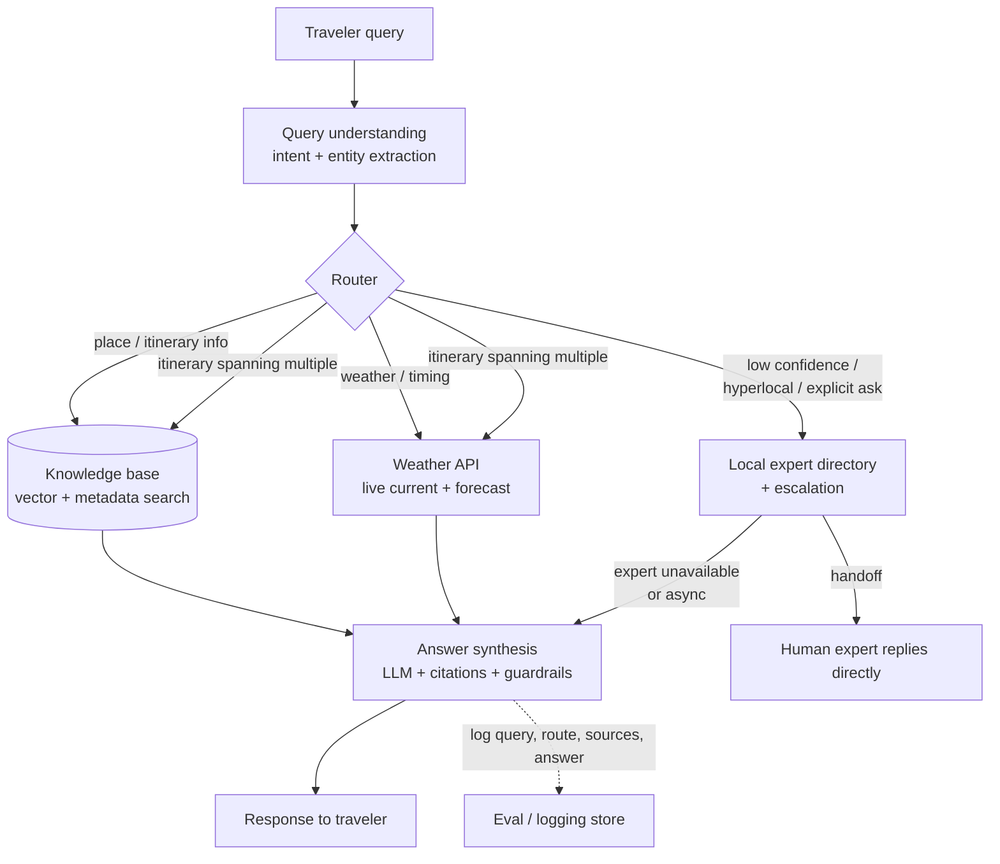

# Architecture — Assam travel bot (POC)

Decisions here are provisional for the POC. If this gets promoted (`pocs/README.md`), the stack and any hard-to-reverse choices (vector DB, weather vendor, expert-escalation model) get re-examined and written up as real ADRs in `docs/architecture/decisions/` — nothing here is binding beyond this experiment.

## What the bot needs to do

A traveler asks a free-text question. The bot needs to answer it using the right source of truth:

1. **"What is this place, is it worth visiting, how do I get there?"** → curated knowledge base.
2. **"What's the weather like there / should I go this week?"** → live weather data, not the knowledge base (weather in a KB goes stale immediately and must never be guessed by the LLM).
3. **"I need something hyperlocal / current / booking-related that isn't in the KB and isn't weather"** → a human local expert.
4. Multi-turn refinement of any of the above ("what about in winter instead?").

The core design problem is the **router**: deciding which source (or combination) answers a given query, and only then generating a natural-language answer — never letting the LLM answer 1 or 2 from parametric memory.

## Component overview

## Query-answering pipeline, step by step

1. **Ingest** — traveler message + session history (for multi-turn context, e.g. "what about X" referring to a place named two turns ago).
2. **Query understanding** — an LLM call (or lightweight classifier) extracts:
   - Intent: `place_info | weather | itinerary | expert_needed | chitchat/out_of_scope`
   - Entities: place name(s), district, date/season, activity type (trekking, wildlife, village tourism, etc.)
3. **Route**, possibly to more than one source for a compound query:
   - **KB route** — hybrid search: vector similarity over place descriptions + metadata filter (district, category, season) → top-k chunks.
   - **Weather route** — resolve place → coordinates (from KB metadata) → call weather API for current/forecast → structured weather data, *not* free text, so the LLM can't misreport it.
   - **Expert route** — triggered when: KB retrieval confidence is below threshold, the query is explicitly hyperlocal/booking-related, or the user explicitly asks for a human. Looks up the expert directory by region/specialty, creates a handoff record. For the POC this is mocked (logged + simulated reply), not real notification infra.
4. **Answer synthesis** — one LLM call composes the final answer from whatever was retrieved, under explicit guardrails:
   - Weather facts come verbatim from the API result — the model restates them, never invents or extrapolates them.
   - Place facts are grounded in retrieved KB chunks with a source reference; if nothing relevant was retrieved, the model says so instead of filling the gap from pretraining (this is the main hallucination risk to watch for on underrated/low-documentation places).
   - If routed to an expert, the response is explicit about being a handoff, not a bot-authored answer.
5. **Respond**, and log the full trace (query, extracted intent/entities, route taken, sources retrieved, final answer) for evaluation — this log *is* the mechanism for judging the exit criteria, so it needs to exist from the first test run, not bolted on later.

## Knowledge base

- **Content**: hand-curated entries for ~20-30 underrated Assam places. Each entry: name, district, category, short description, how to reach, best season, safety/access notes, coordinates, source/attribution.
- **Storage**: vector embeddings for semantic search over the description text, plus structured metadata for filtering (district/category/season) — pure vector search alone will under-serve queries like "show me heritage sites near Sivasagar in winter."
- **Why curated, not scraped, for the POC**: the hypothesis is about answer quality given *good* source data. Scraping/ingestion pipeline quality is a separate question — conflating the two would make a bad result ambiguous (bad retrieval? bad data? bad synthesis?).

## Weather

- One external weather API (current + short-range forecast) keyed by lat/long from the KB's place metadata.
- Treated as a tool call with a structured return, not a document to retrieve-and-summarize — this is a hard boundary, not a style preference (see guardrails above).

## Local experts

- Directory: expert profile (name, regions/specialties covered, contact channel). Mocked for the POC — real matching/notification/messaging is out of scope until the routing decision itself is validated.
- What we're actually testing here: *does the router correctly identify when it should hand off rather than guess*, not whether the expert marketplace works end to end.

## Guardrails (see `docs/standards/security-checklist.md`)

- Any content that flows back into a prompt from an external source — KB chunks, weather API response, a (future) real expert's reply — is treated as data, not instructions. Relevant even in the POC because KB entries are freeform text.
- No fabricated weather, ever — this is the one guardrail worth writing a test for before anything else, since a confidently wrong weather answer is the failure mode most likely to actually hurt a traveler.

## Evaluation

Before building: write ~30 realistic traveler queries spanning all four intents (including a few deliberately ambiguous/compound ones), each with a rubric of what a good answer looks like and which route it should take. This set is what the exit criteria in `README.md` are measured against — build it before touching the pipeline, not after.

## Open questions (resolve before/while building, not after)

- Confidence threshold for KB → expert fallback: start with a fixed similarity cutoff, expect to tune against the eval set.
- Single combined LLM call for intent+routing vs. a separate lightweight classifier — try the single-call version first since it's less to build, revisit if routing accuracy is the bottleneck.
- Stack (language, vector store, weather provider): not yet chosen — pick for speed of building this specific pipeline, not for production suitability. Record whatever's chosen in this file once decided so the next person doesn't have to guess.
