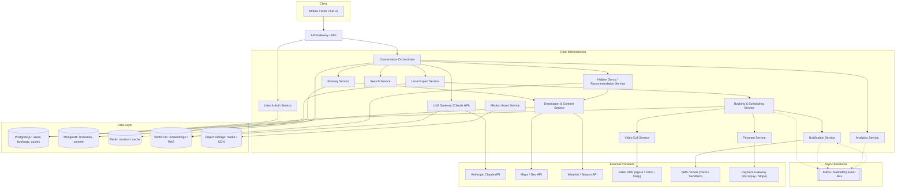
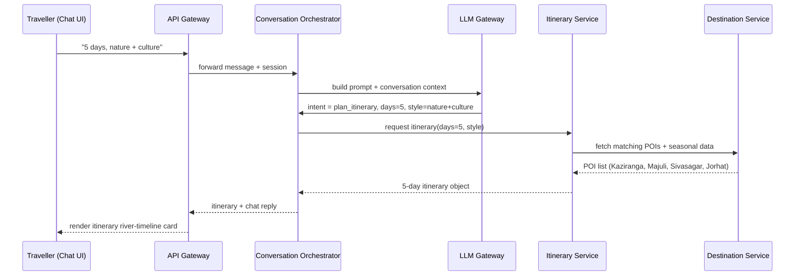
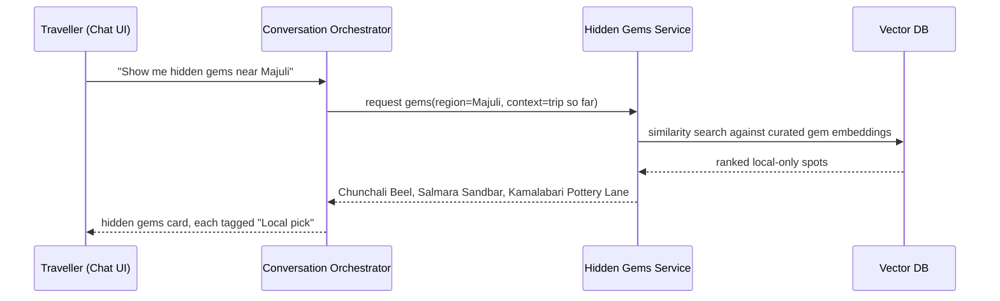
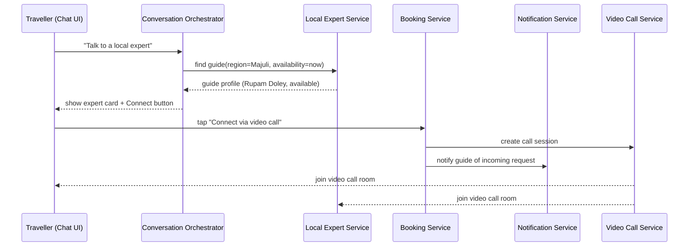
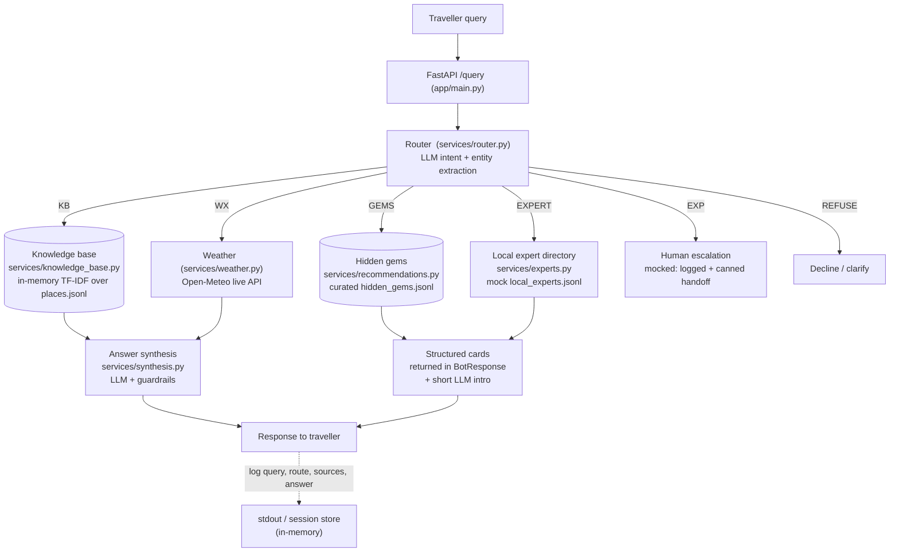

# Architecture — Oxomiai (Assam travel bot)

**Oxomiai** is a conversational travel companion for Northeast Assam. Beyond
generating itineraries it differentiates on two fronts:

1. **Hidden gems** — surfacing lesser-known spots (Chunchali Beel, Salmara
   Sandbar, Kamalabari Pottery Lane…) that guidebooks and "top 10" lists miss.
2. **Verified local experts** — connecting a traveller to a real person who
   lives there, for a live video consultation.

This document describes the **target production architecture** (a microservices
system built around those two differentiators) and then maps it to **what the
POC actually builds** — a single modular monolith that mocks everything that
isn't needed to test the core hypothesis.

Nothing here is binding. If the POC is promoted (`pocs/README.md`), the stack
and any hard-to-reverse choices (vector DB, weather vendor, video SDK, expert
model) get re-examined and written up as real ADRs in
`docs/architecture/decisions/`.

See `docs/demo/` for the product demo (`oxomiai-demo.mp4` + the self-contained
`oxomiai-demo.html`) that this architecture is designed to deliver.

---

## 1. What the bot needs to do

A traveller asks a free-text question. The bot answers it from the right source
of truth, and only then generates natural language — it never answers a factual
question from the LLM's parametric memory.

| Ask | Source | Route code |
|---|---|---|
| "What is this place, is it worth visiting, how do I get there?" | Curated knowledge base | `KB` |
| "Plan me 5 days, nature + culture" | Itinerary logic over the KB | `KB` (`+WX`) |
| "What's the weather there / should I go this week?" | Live weather API — never the KB, never guessed | `WX` |
| "Show me hidden gems near Majuli" | Hidden-gems / recommendation service | `GEMS` |
| "Can I talk to someone who actually lives there?" | Local-expert directory + booking | `EXPERT` |
| "Is the road to X currently passable / can you book me a permit?" | Human expert escalation (hyperlocal, live, transactional) | `EXP` |
| Out of scope | Decline / clarify | `REFUSE` |

The core design problem is the **router**: deciding which source (or
combination) answers a given query.

---

## 2. Target system diagram

The source of this diagram lives at `docs/architecture-diagram.mermaid`.

---

## 3. Services & responsibilities (target)

| Service | Responsibility | Talks to |
|---|---|---|
| **API Gateway / BFF** | Single entry point for the chat client. Auth check, rate limiting, request routing, response shaping for mobile/web. | All client-facing traffic |
| **User & Auth Service** | Signup/login, JWT issuance, profile, preferences (past trips, saved itineraries). | PostgreSQL |
| **Conversation Orchestrator** | The "brain." Owns chat session state, decides intent routing, assembles the final chat response. | LLM Gateway, Itinerary, Gems, Expert, Search, Redis |
| **LLM Gateway** | Wraps Claude API calls: prompt templates, conversation-context assembly, RAG retrieval from the vector DB, cost/rate tracking, streaming. | Claude API, Vector DB |
| **Itinerary Service** | Day-by-day route generation (pacing, distance between stops, day-count constraints). Persists generated itineraries. | Destination Service, MongoDB |
| **Destination & Content Service** | Curated POI data — Kaziranga, Majuli, Sivasagar, Jorhat, Kamakhya, Pobitora… — descriptions, images, seasonal notes. | MongoDB, Maps API, Weather API |
| **Hidden Gems / Recommendation Service** | Surfaces lesser-known spots via curated data plus embedding-similarity matching to the user's stated interests. A core differentiator, not a generic "top 10." | Vector DB, Destination Service |
| **Local Expert Service** | Guide profiles, verification/KYC status, languages, specialties, live availability. | PostgreSQL |
| **Booking & Scheduling Service** | Creates a booking when a traveller requests a guide; manages guide calendar and confirmation state. | PostgreSQL, Event Bus |
| **Video Call Service** | Provisions a call room via a video SDK, returns join tokens to both parties. | Video SDK |
| **Notification Service** | Push/SMS/email for booking confirmations, itinerary reminders, guide replies. Consumes bus events. | SMS/Email provider, Event Bus |
| **Search Service** | Powers the quick-topic chips and free-text destination search. | Vector DB or Elasticsearch |
| **Media / Asset Service** | Serves and transforms images (POI photos, the Oxomiai mascot) via CDN. | Object Storage |
| **Payment Service** *(if guide sessions are monetized)* | Charges for paid consultations, guide payouts. | Payment gateway |
| **Analytics Service** | Funnel events (itinerary generated → gem viewed → expert booked). | Event Bus |

---

## 4. Key flows

### 4.1 Itinerary planning

### 4.2 Hidden gems

### 4.3 Connect to a local expert

---

## 5. Data layer (target)

| Store | Used for | Why this choice |
|---|---|---|
| **PostgreSQL** | Users, guide profiles, bookings, payments | Relational integrity for transactional data |
| **MongoDB** | Itineraries, destination/POI content, chat transcripts | Flexible schema — itinerary shape varies by day count and trip style |
| **Redis** | Session state, conversation short-term memory, rate limiting | Low-latency, TTL-based |
| **Vector DB** (Pinecone / Weaviate / pgvector) | Embeddings for hidden-gems matching and RAG context | Semantic similarity is the core mechanism behind "hidden gems," not keyword search |
| **Object Storage (S3-compatible)** | POI photos, mascot assets, call recordings | Cheap, CDN-fronted static delivery |

---

## 6. POC scope — what is actually built

The POC is a **single FastAPI service** (`backend/`) plus a **static
single-file frontend** (`frontend/index.html`). Every target service above
maps to a module or a mock inside that one process:

### Target → POC mapping

| Target service | POC form | Production gap |
|---|---|---|
| API Gateway / BFF | FastAPI app directly (`app/main.py`), permissive CORS | No auth, rate limiting, or request shaping |
| User & Auth Service | none — anonymous sessions keyed by a client-generated id | No accounts, JWT, or saved preferences |
| Conversation Orchestrator | `app/main.py` request handler + `services/router.py` | Session state is an in-memory dict, lost on restart |
| LLM Gateway | `services/llm_provider.py` (Claude / OpenAI / OpenRouter / **mock default**) | No RAG retrieval layer, no cost tracking, no streaming |
| Itinerary Service | prompt path in `services/synthesis.py`; frontend renders the river-timeline card from `Day N:` headers | No pacing/distance logic, itineraries not persisted |
| Destination & Content Service | `knowledge_base/places.jsonl` (6 seed sites) + `knowledge_base/schema.md` | Hand-curated, ~6 entries; target is ~20–30+ with images |
| Hidden Gems Service | `services/recommendations.py` over `knowledge_base/hidden_gems.jsonl`, TF-IDF similarity | No real embeddings / vector DB; ~6 curated gems |
| Local Expert Service | `services/experts.py` over `knowledge_base/local_experts.jsonl` (static profiles, fake availability) | No KYC, no real calendar, availability is hardcoded |
| Booking / Video / Notification | not built — the "Connect via video call" button is inert in the UI | Entire booking + video + notification path is future work |
| Search Service | the frontend's quick chips call `/query` directly | No dedicated search index |
| Media / Asset Service | emoji + inline SVG in the frontend | No image pipeline / CDN |
| Payment / Analytics | not built | Future work |
| Event Bus, PostgreSQL, MongoDB, Redis, Vector DB | none — everything is in-process memory (a `db` container is declared in `docker-compose.yml` but unused) | All persistence and async messaging is future work |

---

## 7. Query-answering pipeline (POC), step by step

1. **Ingest** — traveller message + last 3 turns of session history (for
   multi-turn context, e.g. "what about there in winter" referring to a place
   named two turns ago).
2. **Route** — one LLM call (`services/router.py`) extracts:
   - Intent: `place_info | weather | itinerary | hidden_gems | local_expert | expert_needed | chitchat`
   - Entities: place name(s), district/region, date/season, activity type
   - Route: one or more of `KB / WX / GEMS / EXPERT / EXP / REFUSE`
3. **Retrieve** per route:
   - **KB** — TF-IDF similarity over place descriptions + optional metadata
     filter (district / type / season) → top-k entries.
   - **WX** — resolve place → coordinates (from KB metadata) → Open-Meteo call
     → structured weather data, *not* free text, so the LLM can't misreport it.
   - **GEMS** — similarity match over the curated hidden-gems file, filtered by
     region/interest → ranked list of local-only spots.
   - **EXPERT** — look up the expert directory by region/specialty → one
     available guide profile.
   - **EXP** — hyperlocal / live / transactional query the bot must not answer
     itself; mocked as a logged handoff + canned message.
4. **Synthesize**:
   - `KB` / `WX` → one LLM call composes the answer under guardrails (below).
   - `GEMS` / `EXPERT` → the structured cards are returned verbatim in
     `BotResponse`; the LLM only writes a one-line intro. The data the traveller
     acts on is never paraphrased by the model.
5. **Respond**, and log the full trace (query, intent/entities, route, sources,
   answer). This log *is* the mechanism for judging the exit criteria — it
   exists from the first test run.

---

## 8. Guardrails (see `docs/standards/security-checklist.md`)

- Any content that flows back into a prompt from an external source — KB chunks,
  weather API response, hidden-gem descriptions, a (future) real expert's reply
  — is treated as **data, not instructions**.
- **No fabricated weather, ever.** Weather facts come verbatim from the API
  result; the model restates them and never extrapolates. This is the one
  guardrail worth a dedicated test before anything else — a confidently wrong
  weather answer is the failure mode most likely to actually hurt a traveller.
- **No invented places.** If KB / gems retrieval returns nothing relevant, the
  model says so instead of filling the gap from pretraining — the main
  hallucination risk on underrated, low-documentation spots.
- **Expert answers are labelled as handoffs**, not bot-authored answers.

---

## 9. Evaluation

`eval/queries.md` holds ~30 realistic traveller queries spanning every intent
(including deliberately ambiguous / compound ones), each with a rubric of what a
good answer looks like and which route it should take. The exit criteria in
`README.md` are measured against this set — it was built before the pipeline,
not after.

---

## 10. Build order (target)

1. **User & Auth + API Gateway** — nothing else works without identity.
2. **Conversation Orchestrator + LLM Gateway** — basic chat end to end. *(POC is here.)*
3. **Destination + Itinerary Service** — the core trip-planning value.
4. **Hidden Gems Service** — layer in the vector DB and the first differentiator. *(POC mocks this.)*
5. **Local Expert + Booking + Video Call** — the human-connection differentiator; can ship as a v2. *(POC mocks the directory only.)*
6. **Notification, Search, Analytics, Payments** — supporting services, add as usage grows.

Start as a **modular monolith** while the team is small (2–4 engineers) — keep
the service boundaries above as internal module boundaries (as the POC already
does), and split into real microservices only when a specific module needs
independent scaling or a different release cadence. Video Call and LLM Gateway
are usually the first to split off, since their load/cost profiles differ most
from the rest.

---

## 11. Open questions (resolve before/while building, not after)

- **KB → expert fallback threshold** — start with a fixed similarity cutoff,
  expect to tune against the eval set.
- **Single combined router call vs. a separate lightweight classifier** — the
  POC uses the single call; revisit if routing accuracy is the bottleneck.
- **Hidden-gems ranking** — curated list + TF-IDF in the POC; production needs
  real embeddings and a feedback signal (did the traveller save / visit it?).
- **Expert model** — free vs. paid consultations, guide payout, KYC provider —
  all deferred until the routing decision itself is validated.
- **Stack for production** — vector store, weather vendor, video SDK not yet
  chosen. Record whatever's picked in an ADR so the next person doesn't guess.
